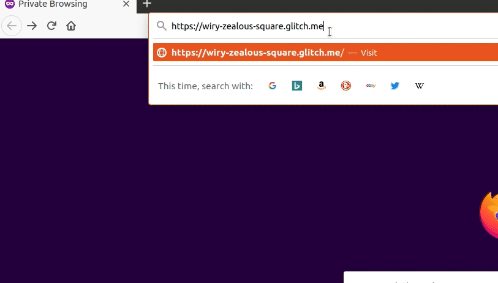

# url-shortener
URL shortener using Node.js and MongoDB

[Live site on glitch](https://wiry-zealous-square.glitch.me/)  

  

## Instructions
got to https://wiry-zealous-square.glitch.me/api/https://www.example.com  
you will be sent a JSON object with a short URL if a valid URL is entered

## Built With

* [Node JS](https://nodejs.org/en/)

## Acknowledgments

* This project idea is from freeCodeCamp    
